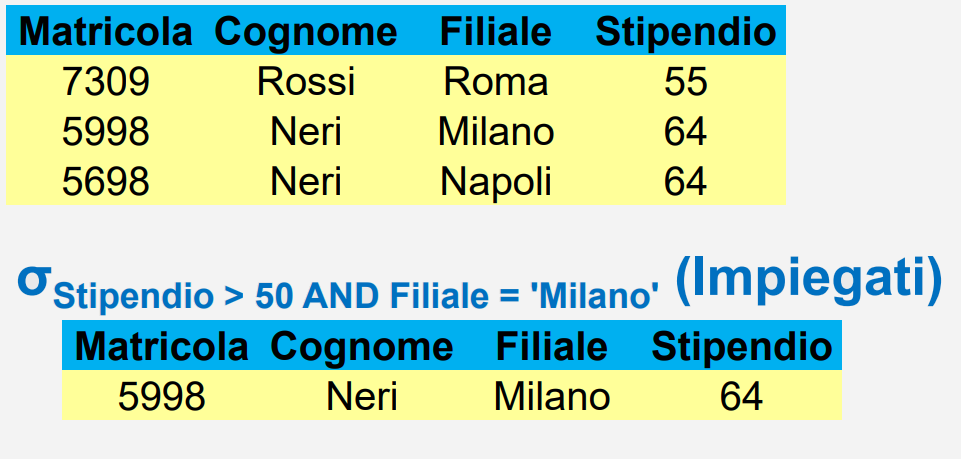
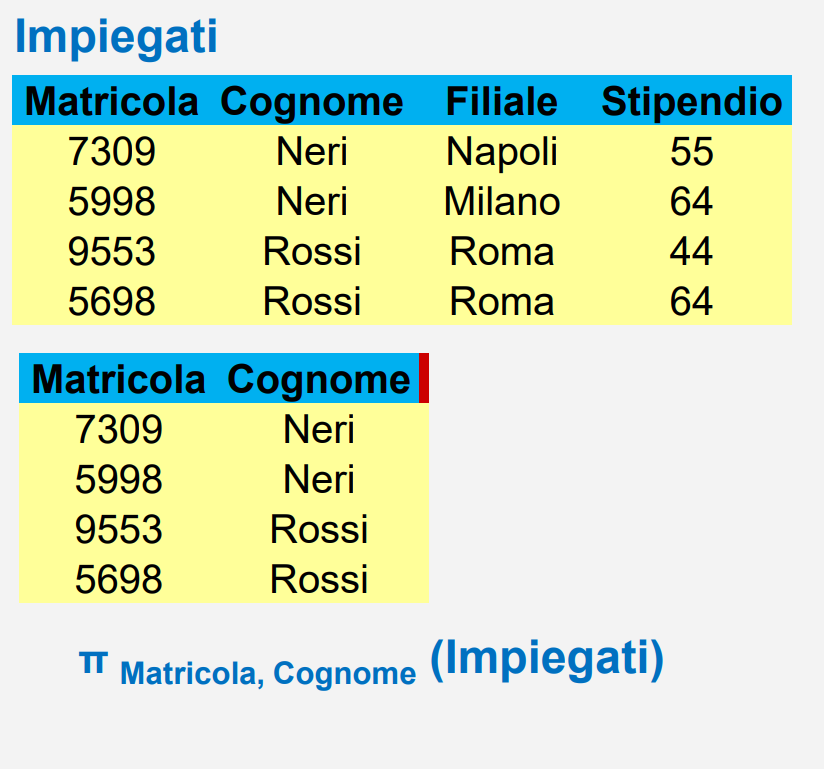
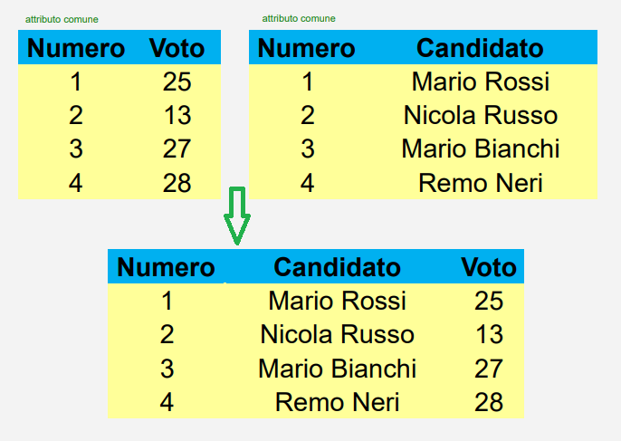

# Algebra Relazionale
È un insieme di operatori:
* su relazioni
* che producono relazioni
* che possono essere composti


# Indice
* [Operatori](#operatori)
* [Unione](#unione)
* [Intersezione](#intersezione)
* [Differenza](#differenza)
* [Ridenominazione](#ridenominazione)
* [Selezione](#selezione)
* [Proiezione](#proiezione)
* [Selezione e Proiezione](#selezione-e-proiezione)
* [Join](#join)

## `Operatori`
* [Unione](#unione) `∪`, [intersezione](#intersezione) `∩`, [differenza](#differenza) `-`
* [Ridenominazione](#ridenominazione) `<--`
* [Selezione](#selezione) `σ`
* [Proiezione](#proiezione) `π`
* [Join](#join) `JOIN`


## `Unione`
Unisce le due tabelle senza duplicare le tuple ( righe della tabella)

> Esempio:
> 

## `Intersezione`
Restituisce le tuple che sono presenti in entrambe le tabelle, cioè le righe che sono presenti in entrambe le tabelle

> Esempio:
> 
> Le righe blu sono quelle che sono presenti in entrambe le tabelle

## `Differenza`
Restituisce le tuple che sono presenti nella prima tabella ma non nella seconda. Da un altro punto di vista potremmo dire che fa la vera e propria sottrazione, togliendo alla **prima** tabella le tuple che sono presenti nella **seconda**

> Esempio:
> 


***ATTENZIONE: Unione, Intersezione e Differenza possono essere applicati solo se le tabelle hanno schema e nomi di attributi uguali***

## `Ridenominazione`
* Lo indichiamo con la lettera `ρ`
* Rinomina gli attributi di una tabella, cioè il nome delle colonne.
* Per leggere meglio la ridenominazione si legge da destra verso sinistra, cioè: **vecchio nome -> nuovo nome**

Sintassi:
```sql
ρ <Nuovo attributo> <- <Vecchio attributo> ( <nome tabella> )
```


> Esempio:
> 
> Dopo fatto ciò, avendo due tabelle con gli stessi nomi di attributi potremmo fare operazioni come l'intersezione, la differenza e l'unione

Possiamo fare anche ridenominazioni multiple, cioè cambiare più attributi alla volta

> Esempio:
> 

## `Selezione`
* Lo indichiamo con la lettera `σ`
* Seleziona le tuple che soddisfano una condizione
* Il risultato è un sottoinsieme delle ennuple della tabella che soddisfano la condizione
* RAGIONANDO CON LE TABELLE POSSIAMO DIRE CHE NOI PRENDIAMO LE RIGHE CHE CI INTERESSANO

***Sintassi:***
```sql
σ <condizione> ( <nome tabella> )
```


> Esempio:
>```sql
>σ stipendio>50 ( Impiegati )
>```

Si possono anche utilizzare più condizioni, in questo caso le condizioni vengono concatenate con l'operatore `AND`

> Esempio:
>```sql
>σ stipendio>50 AND nome='Mario' ( Impiegati )
>```

>Esempio:
>

## `Proiezione`
* Lo indichiamo con la lettera `π`
* Seleziona gli attributi che ci interessano
* RAGIONANDO CON LE TABELLE POSSIAMO DIRE CHE NOI PRENDIAMO LE COLONNE CHE CI INTERESSANO

***Sintassi:***
```sql
π <lista attributi> ( <nome tabella> )
```


> Esempio:
>```sql
>π nome, stipendio ( Impiegati )
>```
> Qui abbiamo selezionato solo le colonne nome e stipendio

> Esempio:
>


## `Selezione e Proiezione`
Possiamo combinare selezione e proiezione in un'unica operazione, estraendo dalla tabella i dati che ci interessano

> Esempio:
>```sql
>π nome, stipendio ( σ stipendio>50 ( Impiegati ) )
>```
> Qui abbiamo selezionato le righe con uno stipendio maggiore di 50 e poi abbiamo selezionato solo le colonne nome e stipendio
>
>Quindi si legge dall'interno delle parentesi verso l'esterno

## `Join`
* Lo indichiamo con `JOIN`
* Il grado della relazione ottenuta come risultato di un join è minore o uguale della somma dei gradi dei due operandi
* Esistono **i seguenti tipi di join**:
    1. [Join naturale](#join-naturale)
    2. [Join esterno](#join-esterno)
    3. [Theta-join](#theta-join)
    4. [Equi-join](#equi-join)

#### `Join naturale`
Sintassi:
```sql
<nome tabella1> JOIN <nome tabella2>
```
Le tuple del risultato sono ottenute combinando tuple degli operandi con valori uguali sugli attributi comuni



Il `join naturale` potrebbe avere degli **"effetti collaterali"** come otterenere:
* *Join non completo*
    - non tutti i valori degli attributi comuni sono uguali, quindi viene fatta una join solo delle righe che hanno questi valori uguali
* *Join vuoto*
    - per mancanza di valori uguali negli attributi comuni

>Esempi:
>
#### `Join esterno`

Sintassi:
```sql
<nome tabella1> JOIN right <nome tabella2>
<nome tabella1> JOIN left <nome tabella2>
<nome tabella1> JOIN full <nome tabella2>
```


Presupponiamo di avere una `tabella destra` e una `tabella sinistra`

Facendo il join esterno possiamo avere 3 tipi di join:
* ***Sinistro*** (Left)
    - Mantiene tutte le righe della `tabella sinistra` e ci estende quelle della `tabella destra` che hanno valori uguali sugli attributi comuni. Se nella tabella di destra non ci sono valori uguali, viene inserito `NULL` al posto dei valori
    - > Esempio di `join sinistro`:
        > 
        > **`Reparto` è l'attributo comune**
        > * In **Arancione** abbiamo i valori presenti negli attributi comuni nella `tabella destra`. Essendo che non hanno corrispondenze nella `tabella sinistra` l'intera riga non viene inserita nella join
        > * In **Azzurro** abbiamo una riga all'interno della `tabella sinistra` che non ha valori uguali negli attributi comuni, quindi viene inserito `NULL` al posto dei valori
        >* **In poche parole nella tabella di join sono presenti tutte le righe ( tuple ) della `tabella sinistra` con in aggiunta le relazioni con la tabella di destra (se esistenti, sennò NULL)**
* ***Destro*** (Right)
    - Mantiene tutte le righe della `tabella destra` e ci estende quelle della `tabella sinistra` che hanno valori uguali sugli attributi comuni. Se nella tabella di sinistra non ci sono valori uguali, viene inserito `NULL` al posto dei valori
    - > Esempio di `join destro`:
       > 
        > **`Reparto` è l'attributo comune**
        > * In **Arancione** abbiamo i valori presenti negli attributi comuni nella `tabella sinistra`. Essendo che non hanno corrispondenze nella `tabella destra` l'intera riga non viene inserita nella join
        > * In **Azzurro** abbiamo una riga all'interno della `tabella destra` che non ha valori uguali negli attributi comuni, quindi viene inserito `NULL` al posto dei valori
        > * **In poche parole nella tabella di join sono presenti tutte le righe ( tuple ) della `tabella destra` con in aggiunta le relazioni con la tabella di sinistra (se esistenti, sennò NULL)**
* ***Completo*** (Full)
    - Mantiene le righe di entrambe le tabelle, collegandole per valori uguali negli attributi comuni. Se non ci sono valori uguali, viene inserito `NULL` al posto dei valori
    - > Esempio di `join completo`:
        > 
        > **`Reparto` è l'attributo comune**
        > * In **Azzurro** abbiamo le righe della `tabella sinistra` e della `tabella destra` le quali non hanno valori uguali negli attributi comuni, quindi viene inserito `NULL` al posto dei valori nella tabella di join
        > * **In poche parole nella tabella di join sono presenti tutte le righe ( tuple ) della `tabella sinistra` e della `tabella destra` con in aggiunta le relazioni con l'altra tabella (se esistenti, sennò NULL)**

#### `Theta-join`
Sintassi:
```sql
<nome tabella1> JOIN<condizione> <nome tabella2>
```

#### `Equi-join`
Sintassi:
```sql
<nome tabella1> JOIN<condizione> <nome tabella2>
--> La condizione sarà sempre di uguaglianza
```
> Esempio:
>
>
> Si uniscono le righe con valori uguali negli attributi comuni, in questo caso il `reparto` e il `codice` devono essere uguali


[Torna all'indice](#indice)

[Torna alla Home](/README.md)
